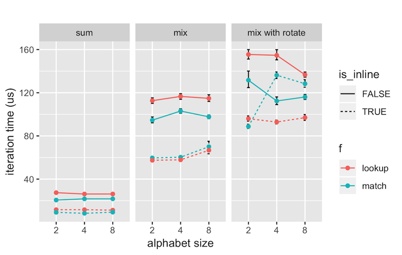

# A question about Rust inlining

I'd expect a match lookup like:

```rust
fn match2(x: u8) -> u64 {
    match x {
        b'A' => 1,
        b'B' => 2,
        _ => 0,
    }
}
```

to always be faster than a lookup table like:

```rust
lazy_static! {
    static ref LOOKUP2: [u64; 256] = {
        let mut l = [0; 256];

        l[b'A' as usize] = 1;
        l[b'B' as usize] = 2;

        l
    };
}

#[inline(always)]
fn lookup2(x: u8) -> u64 {
    LOOKUP2[x as usize]
}
```

Most of the time this appears to be the case.
However, when inlining and doing a slightly more advanced calculation:

```rust
for idx in 0..1000 {
    for x in s.as_bytes().iter().skip(idx).take(32) {
        out ^= lookup2(*x)
    }
}
```

lookup is just a hair faster.

If we throw in a `rotate_left`:

```rust
for idx in 0..1000 {
    for x in s.as_bytes().iter().skip(idx).take(32) {
        out ^= lookup2(*x).rotate_left(idx as u32)
    }
}
```

then lookup is a lot faster!
Here's a picture:




What's going on!?!

Questions:

+ Shouldn't match always be at least as fast as a lookup table because the compilers have access to more information upfront?
+ Why does time sometimes decreas as the alphabet size (number of match cases) increases?
+ Maybe the issue is something to do with memory access? But shouldn't repeated linear access of a 10k ascii string fit pretty well in caches?
+ What are good resources to learn about how to debug and reason about this kind of performance?


## Run the benchmarks yourself

You'll need rust installed to benchmark and R installed to make a plot:

    cargo bench
    (copy/paste data into analysis.r and run it)
    

## Kevin's computer

```
2013 Macbook Air, 11" (The best laptop ever made, I'll never "upgrade", come at me!)
Intel(R) Core(TM) i7-4650U CPU @ 1.70GHz
OS X 10.9.5
rustc 1.31.1 (b6c32da9b 2018-12-18)
```
